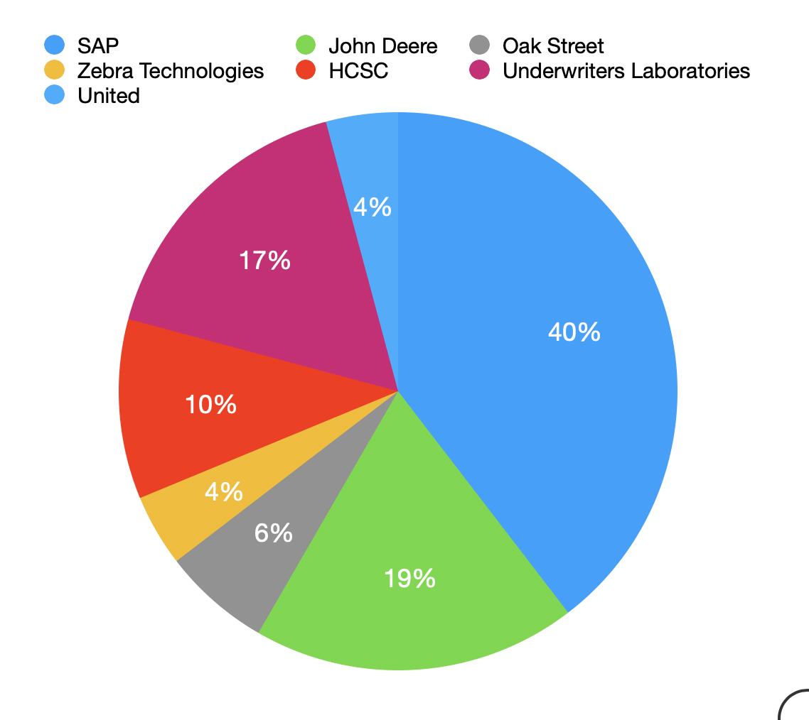
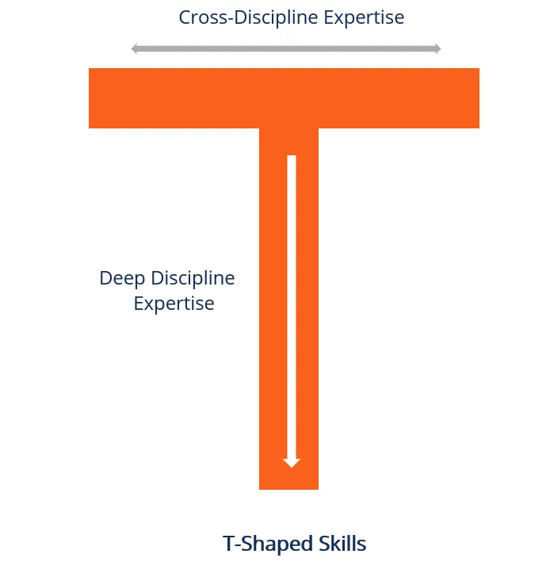

# Tech Roles and Interviewing

---

<!-- Most common roles (so far) -->

<!-- - Software Developer
- Consultancy/Engagement
- Data Scientist / Business Analyst
- Project Manager
- Sales
- Customer Support -->

---

<!-- Employer partners (so far) -->

<!-- 
- SAP
- John Deere
 -->

---
# Typical Roles on a Software Team

## Software Developer
- Writes code to create software applications

### Specialties
- Frontend
- Backend
- Mobile
- Integrations
- and more...

---

# Typical Roles on a Software Team

## UI/UX Designer
- Responsible for creating wireframes and prototypes, as well as helping to design the look and feel of your app.

## Quality Assurance Engineer and Tester
- Tests the software applications to ensure that they meet the requirements and are free from bugs

---

# Typical Roles on a Software Team

## Project Manager
- Oversees the software development project from start to finish

## Product Owner / Business Analyst
- Defines the product vision and ensures that the software development team is building the right product

---
# Adjacent roles you might see

## DevOps
- Deploys, monitors, and maintains the software applications and infrastructure

## Data Scientist
- Analyzes and interprets data to gain insights that can be used to inform business decisions

---

# Adjacent roles you might see

## Sales
- Identifies potential customers, builds relationships with them, and sells the software product

## Marketing
- Promotes the software product and builds brand awareness

## Support
- Assists customers with their inquiries, technical issues, and concerns

---
# Interviewing for Software Developer Jobs

---

---

# Application Submission 📬
- Submit your application through the company's applicant tracking system (ATS).
- Some application tracking systems will screen out resumes that don't match the job description
- I built https://cv-boost.com to help tailor your resume for the job you are applying for
- Leverage your network to get around ATS
- Include a cover letter

---

# Initial Screening 📞
- Assess your basic qualifications, skills, and fit for the position.
- You might have a phone interview with a recruiter or hiring manager
- Use https://shadowing.ai/ to practice

<!-- this could be a coffee or lunch (especially when from your network)  -->

---

# Technical Interview 🧑‍💻
- Solve coding exercises, technical challenges, or a small take-home project 
- May have you pair up with an engineer to solve a coding problem, review a pull request or do a code review to assess how you think and communicate
- Practice:
    - https://leetcode.com/
    - https://exercism.org/

<!-- Algorithms, Data structures, Architecture, Problem-solving -->
---

# On-Site/Remote Interviews 🎤
- A series of interviews with different members of the team
- These interviews can cover various topics
    - System Design
    - Software Architecture
    - Coding
    - Algorithms
    - Behavior
    - etc.
- The purpose is to assess your technical abilities, problem-solving skills, communication, and how well you work in a team.

---

# Offer and Negotiation 🤑
- If successful, they will extend an offer with details about compensation, benefits, and other relevant terms.
- At this point, you may have the opportunity to negotiate the offer 

---

# Rejection 😭
- Don't take it personal
- It says more about the company than you
- Keep putting yourself out there

---

# Focus on what you can control 🙌
- Keep your resume updated and tailored to the job https://cv-boost.com
- Work on coding problems at https://leetcode.com and https://exercism.org/
- Practice interviewing https://shadowing.ai/
- Keep building your portfolio and share it with your network
- Most job opportunities are never posted and come from your network
